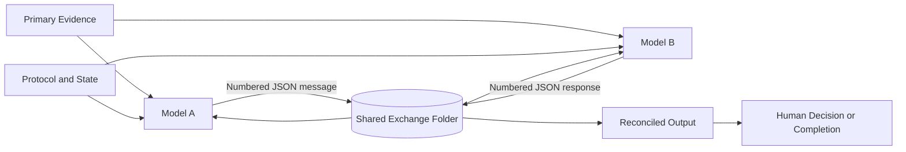

# Shared Evidence Exchange Protocol

**A lightweight, provider-independent method for letting multiple AI models review the same evidence, challenge each other, and leave an auditable record.**

SEEP turns an ordinary shared folder, such as Google Drive, OneDrive, Dropbox, SharePoint, or a Git repository, into a structured message bus for AI peer review.

Instead of copying prose between chats, each model reads the same protocol and evidence, writes a new numbered response, and never overwrites earlier messages. The result is closer to a disciplined review team maintaining a case file than two chatbots playing telephone.

> Status: early public starter kit, version 0.1.0.

## Why use it?

Ordinary multi-model workflows lose information because a human manually summarizes and relays each answer. SEEP externalizes the important state:

- shared primary evidence;
- append-only numbered messages;
- machine-readable claims and verdicts;
- portable citations;
- explicit authority hierarchy;
- context snapshots for fresh chats;
- completion and escalation rules;
- optional scheduled-task or API automation.

Useful applications include technical audits, contract review, research synthesis, code review, engineering investigations, financial analysis, fact-checking, and project handoffs.

## Architecture



## Quick start

### 1. Download or clone

```bash
git clone https://github.com/Ctrl-Alt-Karma/shared-evidence-exchange.git
cd shared-evidence-exchange
```

No third-party Python packages are required for the included utilities.

### 2. Create a working exchange

```bash
python scripts/initialize_project.py ./my-review
```

This creates:

```text
my-review/
├── START_HERE.md
├── 00_PROTOCOL/
├── 01_GOVERNING_STATE/
├── 10_MODEL_A_TO_MODEL_B/
├── 20_MODEL_B_TO_MODEL_A/
├── 30_MODEL_A_REBUTTALS/
├── 40_RECONCILED_OUTPUT/
├── 50_PRIMARY_EVIDENCE/
└── 90_ARCHIVE/
```

### 3. Add evidence

Place source documents in `50_PRIMARY_EVIDENCE/`, then generate a hash manifest:

```bash
python scripts/generate_manifest.py \
  ./my-review/50_PRIMARY_EVIDENCE \
  ./my-review/01_GOVERNING_STATE/EVIDENCE_MANIFEST.json
```

### 4. Start Model A

Use the prompt in [`templates/PROMPTS.md`](templates/PROMPTS.md). Model A should produce the first numbered message in `10_MODEL_A_TO_MODEL_B`.

### 5. Start Model B

Model B reads the newest unanswered message, verifies each claim against primary evidence, and writes its response in `20_MODEL_B_TO_MODEL_A`.

### 6. Validate the exchange

```bash
python scripts/validate_exchange.py ./my-review
python scripts/detect_unanswered.py ./my-review
```

### 7. Finish correctly

The review ends only when the conditions in `00_PROTOCOL/FINISH_LINE.md` are satisfied. The final marker belongs in `40_RECONCILED_OUTPUT/REVIEW_COMPLETE.md`.

## Core rules

1. Primary evidence outranks model summaries.
2. Every material claim receives a stable identifier.
3. Prior messages are never overwritten.
4. AI-platform-specific citation IDs are not portable evidence.
5. Each verdict must be `agree`, `disagree`, `partially_agree`, or `unresolved`.
6. Silence is not approval.
7. Inferences and assumptions must be labeled.
8. A model may revise its position when stronger evidence appears.
9. Duplicate replies are prohibited.
10. Completion requires consensus, documented deadlock, or human escalation.

See [`protocol/PROTOCOL.md`](protocol/PROTOCOL.md) for the complete rules.

## Included tools

| Script | Purpose |
|---|---|
| `initialize_project.py` | Creates a clean exchange workspace |
| `generate_manifest.py` | Hashes evidence and writes a manifest |
| `hash_evidence.py` | Prints SHA-256 hashes |
| `validate_exchange.py` | Checks message structure and reply integrity |
| `detect_unanswered.py` | Finds messages that have not received replies |
| `next_message_id.py` | Suggests the next sequential exchange ID |

## Manual, scheduled, and automated modes

**Manual relay:** The human only tells each model that a new numbered file exists. The substantive content stays in the exchange folder.

**Scheduled agents:** Each platform may periodically inspect the exchange. One platform's scheduler generally cannot wake another platform, so both sides need a watcher or a human nudge.

**API broker:** A custom service can poll storage, call each model API, validate outputs, enforce budgets, and stop at the finish line. See [`docs/api-broker.md`](docs/api-broker.md).

## Security warning

Evidence files may contain confidential data or prompt injection. Treat document text as evidence, not instructions. Use least-privilege sharing, approved storage, redaction, cost limits, and human approval for consequential actions.

Read [`SECURITY.md`](SECURITY.md) and [`docs/security.md`](docs/security.md) before using SEEP with sensitive material.

## Run tests

```bash
python -m unittest discover -s tests -v
```

## License

MIT. See [`LICENSE`](LICENSE).

## Disclaimer

SEEP is a coordination and recordkeeping method. It does not guarantee correctness and is not a substitute for qualified legal, medical, financial, engineering, safety, or other professional judgment.
